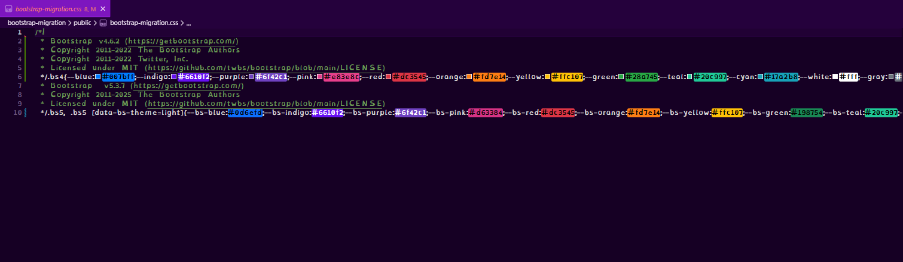
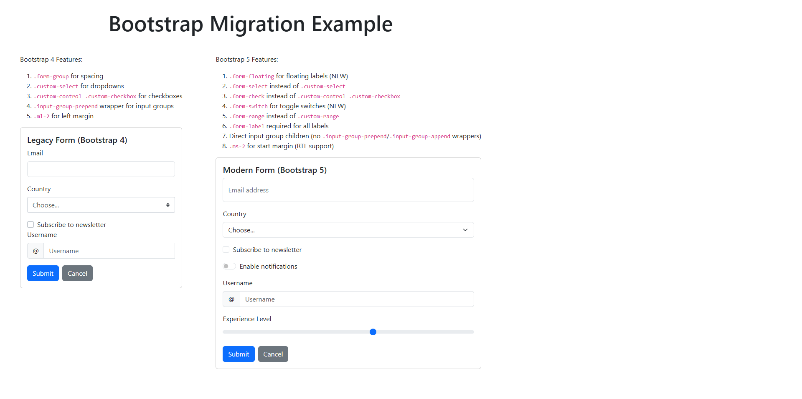

# Bootstrap Migration Proof of Concept

This project demonstrates how to use both Bootstrap v4 and v5 side-by-side in a modern React/Vite application. It showcases scoping of Bootstrap versions using PostCSS, allowing legacy Bootstrap 4 components and new Bootstrap 5 components to coexist without style conflicts.

## Key Features

- **Bootstrap v4 and v5 loaded together**: Bootstrap 5 is installed via npm; Bootstrap 4 is downloaded as a static asset.
- **Scoped CSS**: PostCSS with `postcss-prefixwrap` is used to namespace each version (`.bs4` for v4, `.bs5` for v5), preventing style collisions. Components without a prefix will receive neither set of styles.
- **One import**: Import the migration Bootstrap CSS from one stylesheet `<link rel="stylesheet" href="/bootstrap-migration.css" />`, which can later be ejected once v4 and PostCSS prefixes are removed
- **Migration-friendly**: Easily migrate components from v4 to v5 by changing their wrapper class.
- **React + Vite**: Fast development environment with hot module replacement.

## How It Works

- Bootstrap 4 and 5 CSS and JS are downloaded and placed in the `public` folder.
- Bootstrap 5 is installed via npm and imported in the app as a staged package to be used once the migration is complete
- PostCSS processes the CSS to scope each version.
- Components are wrapped in either `.bs4` or `.bs5` via a reusable `Bootstrap` component to apply the correct styles.

## Why?

This setup is ideal for teams migrating large codebases from Bootstrap 4 to 5, allowing gradual migration and easy comparison of styles and features with with clear style separation and minimal conflicts and without fighting breaking changes.


## Migration Steps

1. Follow this setup guide to create PostCSS Bootstrap 4 and Bootstrap 5 prefixes and a wrapper component
2. Wrap all components in Bootstrap 4
3. Begin converting all component syntax and wrappers to Bootstrap 5
4. Eject Bootstrap 4
5. Remove PostCSS Bootstrap 5 prefix and Bootstrap 5 wrappers (rely on Node package)


## Usage

1. Install dependencies: `npm install`
2. Download Bootstrap 4 and 5 assets: `npm run download:bootstrap4` and `npm run download:bootstrap5`
3. Add v4 prefix: in `postcss.config.cjs`, comment out the `.bs5` prefix, then run `npm run scope:bootstrap4`
4. Add v5 prefix: in `postcss.config.cjs`, comment out the `.bs4` prefix, then run `npm run scope:bootstrap5`
5. Build combined scoped CSS: `npm run build:css`
6. Start the app: `npm run dev`

## How to Set Up Bootstrap v4 and v5 Scoping in Any Project

Follow these steps to recreate the migration proof of concept in your own repository:

1. **Initialize your project**
   
   Create a new project folder and initialize with your preferred frontend stack (e.g., React + Vite):

     ```bash
     npm create vite@latest my-app -- --template react
     cd my-app
     npm install
     ```

2. **Install Bootstrap v5 via npm**

   Note: This is not used during migration and only used after v4 and PostCSS prefixing is ejected.

   ```bash
   npm install bootstrap
   ```

3. **Download Bootstrap v4 as scoped assets**
   
   Download the CSS and JS files from the official CDN:

     ```bash
     curl -o public/bootstrap4-scoped.css https://cdn.jsdelivr.net/npm/bootstrap@4.6.2/dist/css/bootstrap.min.css

     curl -o public/bootstrap4-scoped.bundle.min.js https://cdn.jsdelivr.net/npm/bootstrap@4.6.2/dist/js/bootstrap.bundle.min.js

     curl -o public/bootstrap5.css https://cdn.jsdelivr.net/npm/bootstrap@5.3.7/dist/css/bootstrap.min.css

     curl -o public/bootstrap5.bundle.min.js https://cdn.jsdelivr.net/npm/bootstrap@5.3.7/dist/js/bootstrap.bundle.min.js
     ```

4. **Install PostCSS and postcss-prefixwrap**
   ```bash
   npm install --save-dev postcss postcss-cli postcss-prefixwrap sass
   ```

5. **Configure PostCSS**
   
   Create `postcss.config.cjs` in your project root:

   NOTE: only one prefix can be ran at a time, which means that one or the other `prefixWrap()` will always need to be commented out when running script commands.

     ```js
     const prefixWrap = require('postcss-prefixwrap');
     module.exports = {
       plugins: [
         prefixWrap('.bs4'),
         prefixWrap('.bs5'),
       ],
     };
     ```

6. **Create a migration SCSS file that can later be ejected**
   
   Example: `src/styles/bootstrap-migration.scss`

     ```scss
     @use "bootstrap/scss/bootstrap" as *;
     @import "../public/bootstrap4.css";
     ```

7. **Build the migration CSS**
   
   Add a script to your `package.json`:

     ```json
     "build:css": "cat public/bootstrap4-scoped.css public/bootstrap5-scoped.css > public/bootstrap-migration.css"
     ```

   - Run:
     ```bash
     npm run build:css
     ```

8. **Reference the migration CSS in your HTML**
   
   Add to your `index.html`:

     ```html
     <link rel="stylesheet" href="/bootstrap-migration.css" />
     ```

9. **Scope your components**
   - Create a reusable component that takes in a `version` and `children` which prefixes with either version 4 or 5 of Bootstrap
      - Wrap Bootstrap 4 components in `<div class="bs4">...</div>`
      - Wrap Bootstrap 5 components in `<div class="bs5">...</div>`


## Important: Scoping Bootstrap v4 and v5

To ensure styles are correctly scoped, you must update your `postcss.config.cjs` before each build step:

1. **Scope Bootstrap v4:**
   - Set your `postcss.config.cjs` to:
     ```js
     const prefixWrap = require('postcss-prefixwrap');
     module.exports = { plugins: [prefixWrap('.bs4')] };
     ```
   - Run:
     ```bash
     npm run scope:bootstrap4
     ```

2. **Scope Bootstrap v5:**
   - Change your `postcss.config.cjs` to:
     ```js
     const prefixWrap = require('postcss-prefixwrap');
     module.exports = { plugins: [prefixWrap('.bs5')] };
     ```
   - Run:
     ```bash
     npm run scope:bootstrap5
     ```

3. **Combine both scoped files:**
   - Run:
     ```bash
     npm run build:css
     ```

4. **Reference only the combined migration stylesheet in your HTML:**
   ```html
   <link rel="stylesheet" href="/bootstrap-migration.css" />
   ```

5. **Wrap your components:**
   - Use `<div class="bs4">...</div>` for Bootstrap 4
   - Use `<div class="bs5">...</div>` for Bootstrap 5

**Note:**
- Do not import or link the original, unscoped Bootstrap CSS files anywhere else in the application.
- All Bootstrap styles will only apply inside their respective `.bs4` or `.bs5` containers.
- Components that are not scoped will only receive styles applied other than Bootstrap, if any (or will receive browser defaults)


## Screenshots

### Migration CSS combined file



### Forms




